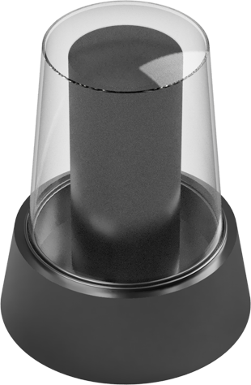
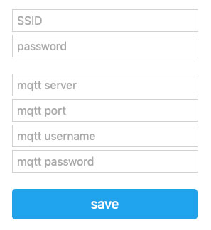

# ESP-12 Wifi MQTT LED Siren
I wanted to find a cheap way to signal warnings and information via a Siren. I couldn't find any Siren on Amazon/Ebay which supports multiple colors or siren modes.


So I decided to build one by myself.

## Build & Setup
The build section explains how to make your own Alarm and the setup shows the necessary steps to be able send your first commands to the Alarm.

### How to build the Alarm
The alarm model was designed in Fusion360 and it's build on the ESP8266 (ESP12) which controls the LED's based on the received commands.

#### Alarm Model
The alarm was designed in two parts. The glass top and the base. Both can be find as a Fusion360 version. Feel free to modify it. I used transparent filament for the top and a plain black PLA for the bottom.



You can access my 3D model via [Fusion360](https://a360.co/2TzcIWP).

#### Parts, Sketch & Schematic

Used parts:

- ESP12 / Wemos D1 mini
- WS2801 LED's

Check out the Arduino sketch: [Arduino Sketch](esp12-alarm.ino)

### How to setup the Alarm
The Siren connects to your local WIFI and is controlled via MQTT. Follow the 4 steps from setup to sending your first commands.

#### 1. Power up & connect to hotspot
After you powered on the Alarm for the first time, it will create a temporary hotspot. You will have to connect to that WIFI. The SSID will be something like `Alarm-XX`

#### 2. Configure your Alarm
Once you connected to the temporary hotspot, provide all the required information.



I used https://mosquitto.org/ as a MQTT Server. It works really good.

#### 4. Sending commands
If the Alarm is connected successfully, the Alarm will flash green. Now you can send commands to your Alarm. The Alarm is listening on the MQTT topic `Alarm-XX`, which is named after the hostname. It's the name of the hotspot during configuration phase.

The Alarm accepts JSON in the following format:

```
  {
    'color': 'green', // supported: blue/green/red
    'mode': 'siren', // supported: siren/flash
    'duration': 10 // duration in seconds
  }
```

### Example commands

Green siren for 10 seconds
```
$ mosquitto_pub -A raspberrypi.local -u sonoff -P s0n0ff -t "/Alarm-40" -m "{ 'color': 'red', 'mode': 'siren', 'duration': 10}"```

Blue flash for 10 seconds
```
mosquitto_pub -A raspberrypi.local -u sonoff -P s0n0ff -t "/Alarm-40" -m "{ 'color': 'blue', 'mode': 'flash', 'duration': 10}"
```
